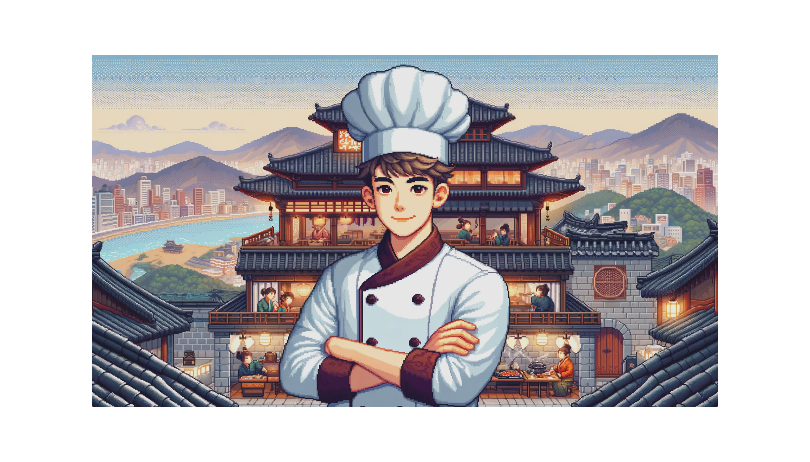
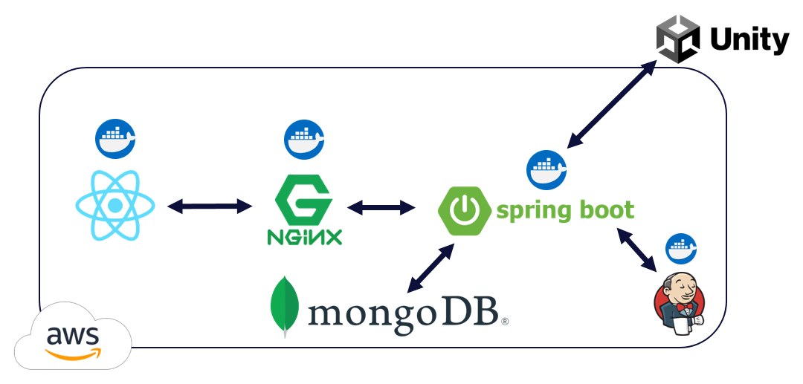
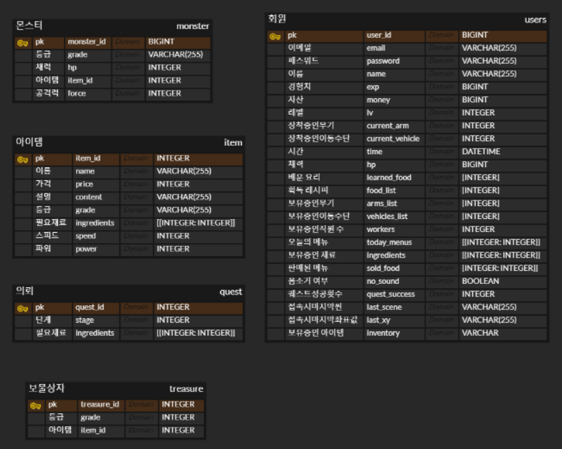
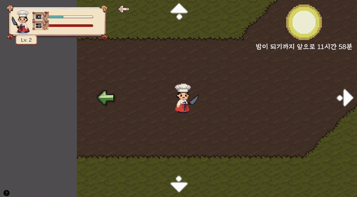
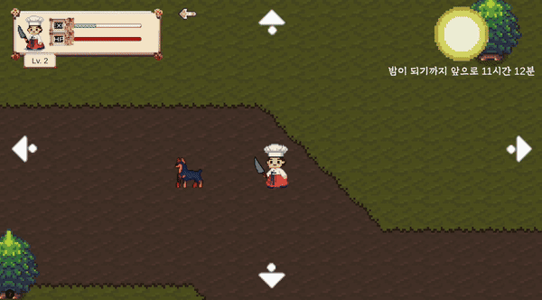
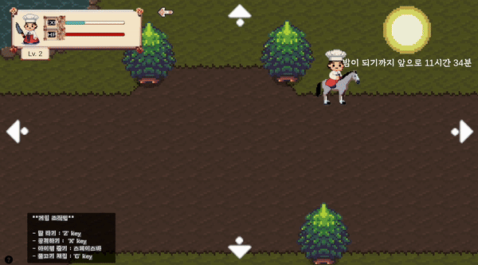
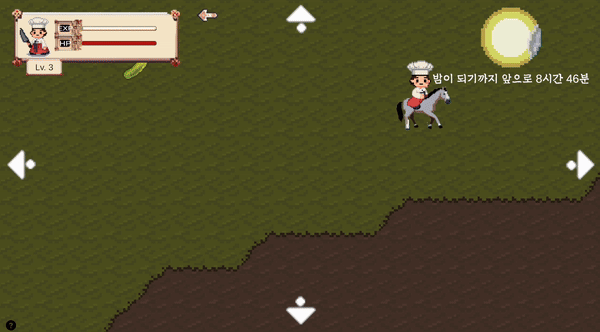
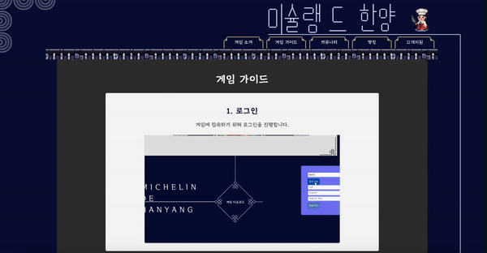
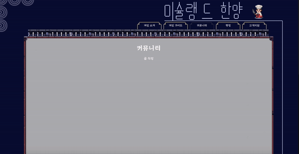
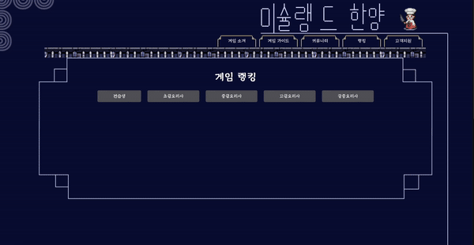

# 포팅메뉴얼

[바로가기](exec/%ED%8F%AC%ED%8C%85%EB%A9%94%EB%89%B4%EC%96%BC.pdf)

# **1. 프로젝트 개요**

> **전통 한식의 여정으로 떠나다 : Michelin De 한양**
> 

<Michelin De 한양>은 가상의 인물이 되어 한식당을 운영하는 게임으로 사용자가 직접 탐험을 해 재료들을 획득해 요리를 만들고 식당을 운영하는 요리 RPG 게임입니다.

**게임 플레이 설명:**

1. **탐험과 수집:** 플레이어는 게임의 낮 시간 동안 다양한 환경의 필드에서 탐험을 하며 재료를 수집합니다. 이 필드는 초급, 중급, 고급으로 나뉘며, 각각 다른 동물과 재료가 존재합니다. 플레이어는 이 재료들을 사용하여 한식 요리를 준비합니다.
2. **요리와 판매:** 밤 시간에는 플레이어가 낮에 수집한 재료와 레시피를 사용하여 요리를 만듭니다. 만든 요리는 식당에서 판매되어 수익을 창출하며, 이 과정에서 플레이어는 한식의 다양한 요리법을 배우고 실습할 수 있습니다.
3. **숨겨진 레시피 발굴:** 게임을 진행하면서 플레이어는 숨겨진 레시피를 발굴할 기회를 얻습니다. 이 레시피들을 통해 플레이어는 한식의 다양성과 깊이를 경험하며, 한국 문화에 대한 이해도를 높일 수 있습니다.

게임의 세계로 여러분을 초대합니다.
한식과 한국 문화의 매력을 직접 체험하고,
조선시대에서 한식당을 성공적으로 운영해 보실 준비가 되셨나요?

---

# 2. 사용 기술 및 설계 산출물

### 2.1 시스템 아키텍쳐

### 2.2 설계 산출물

- 포팅 메뉴얼
- [API 명세 노션 링크](https://www.notion.so/API-4692ead319aa43eaad7ca567036c43ef?pvs=21)
- [요구사항 정의서](https://docs.google.com/spreadsheets/d/1gqJts-9sTdrh3LfjZ41G0vDnl_rtxH0_cC79_v6fmuE/edit#gid=1072179064)
- [기능명세서](https://docs.google.com/spreadsheets/d/1gqJts-9sTdrh3LfjZ41G0vDnl_rtxH0_cC79_v6fmuE/edit#gid=1963453134)
- E-R Diagram
    
    
    

---

# 3. 게임 주요 기능

## 3.1 사냥터

- 조작
    - 방향키를 이동하여 플레이어의 이동 구현, 말을 타고 있는 상태에 따라 이동 속도가 달라지도록 구현
        
        
        
    - 나무, 돌덩이같은 장애물의 경우 플레이어가 통과할 수 없으며, 자연스러운 게임환경 조성을 위해 플레이어가 위치한 y좌표에 따라 sprite sorting order 바뀌도록 구현
    - 플레이어가 공격 시 공격 범위 내에 몬스터가 있으면 그 중 한마리에게 데미지가 들어가도록 구현
        
        
        
    - 플레이어가 사망 시 모달창을 띄워서 메인 화면으로 이동 및 밤 시간대로 변하도록 구현. 모달 창이 뜨는 동안에는 Time.timescale의 값을 0으로 설정하여 게임내의 시간을 멈추도록 구현
    - Collider를 사용하여 맵의 워프 포인트에 도달하면 플레이어가 다른 맵으로 이동하도록 구현.
- 몬스터
    - 지정된 스폰 포인트에서 일정 시간마다 몬스터를 스폰, 각 맵 별로 최대 몬스터 수를 제한
    - 몬스터의 이동 로직 및 몬스터의 이동 방향에 따라 몬스터가 바라보는 방향이 달라지도록 구현
    - CircleCollider2D와 벡터 내적을 사용해 시야각을 구현하여 플레이어가 몬스터의 시야내에 들어오면 플레이어를 추적하도록 구현
    - 몬스터가 플레이어를 추적하는 중이면 일정 시간마다 공격하도록 구현. 공격 시 플레이어가 공격 범위 내에 있으면 플레이어에게 데미지가 들어가도록 구현
    - 몬스터를 잡으면 몬스터 주위에 아이템을 드롭. 드롭 테이블을 구현하여 몬스터가 추가될 때 유니티 인스펙터에서 작업할 수 있도록 구현
- 채집
    - 지정된 채집 포인트에서 채집품이 스폰되며 플레이어가 가까이 있으면 채집 버튼을 통해 채집품을 얻을 수 있도록 구현
        
        
        
- 낚시
    - 플레이어가 연못을 바라보면 낚시를 통해 물고기를 얻을 수 있도록 구현
    - 연못에 쿨타임을 구현하여 낚시 후 일정 시간이 지나야 재낚시가 가능하도록 했으며 낚시 가능 여부를 물고기 그림자를 통해 시각적으로 볼 수 있도록 구현
        
        
        
- 보물상자
    - 보물상자를 평상시에는 안 보이는 상태로 두다가 플레이어가 근접하면 반짝이는 상태로 보이도록 구현
    - 반짝이는 상태에서 C버튼을 누르면 보물 상자가 열리면서 레시피가 나오도록 구현
    - 이미 얻거나 사용한 레시피가 나오는 보물 상자는 중복 획득을 방지하기 위해 사냥터 진입 시 바로 파괴하도록 구현

## 3.2 주막

- **영업 시작 전**
    - 오늘의 메뉴를 통해 판매할 메뉴 개수를 설정할 수 있음.
    - 인벤토리에 가지고 있는 재료에 따라서 최대 요리 개수를 제한함.
    - 밥, 김치, 도토리묵은 기본 요리로, 재료에 따라 제한 없이 최대 3개까지 요리가 가능하도록 제한
    - 요리 배우기를 통해 사냥터에서 획득한 레시피를 이용하여 요리를 배울 수 있음.
        
        
        
- **영업 시작 후**
    - 손님이동 로직
        - 특정 SPOT에서 NPC를 적절한 시간의 간격을 두고 생성 후, 테이블의 타겟 위치를 설정해서 AI 2D NAVMESH를 통해 최적의 루트를 찾아 움직이게 하도록 구현
    - 플레이어 서빙 로직
        - 빛이 나는 테이블에서 z키를 눌러서 랜덤하게 서빙할 요리를 선택하도록 구현
        - 손님이 요구하는 요리의 Sprite와 플레이어가 들고 있는 요리의 Spite를 비교해서 일치하면 서빙하도록 기능 구현.
        
        
        
- **영업 종료**
    - 시간이 다 되거나, 영업 종료를 누르면 판매 결과 창이 나오도록 구현
    - 결과 창을 본 뒤엔 메인 페이지로 이동하도록 구현
    
    
    

## 3.3 상점

- 상점 탭 간 자연스러운 전환을 위해 Corutine메서드와 Lerp 함수 사용
- 물품 우클릭 시 바로 장바구니에 1개씩 아이템이 담기며, 좌클릭 시 아이템에 대한 상세 정보와 함께 수량을 정할 수 있는 팝업 UI가 나와, 장바구니에 아이템을 원하는 수량만큼 담아, 한번에 구매할 수 있음

- 판매 모드로 토글시 현재 인벤토리에 있는 아이템들이 표시되고, 마찬가지로 아이템 클릭시 장바구니에 판매할 아이템들을 담고 한번에 판매
- 상세정보 UI는 IdragHandler를 사용하여 유저가 직접 드래그해 위치를 변경

## 3.4 기타

- 유저 데이터, 설정관리처럼 게임내에서 자주 사용/관리되는 내용은 싱글톤 패턴으로 관리
- ESC를 누를시 게임을 일시정지 시키고 저장하기/무음모드/로그아웃/게임종료 버튼을 누를 수 있는 설정창을 띄움
- 플레이어가 남은 시간을 알 수 있도록 타이머 UI를 일식/월식 형태로 구현. 원 궤도로 움직이도록 했으며 초기 위치를 코사인 제 2법칙을 사용하여 계산 후 적용하도록 구현

---

# 4. 웹 배포 주요 기능

## 4.1 게임 소개

- 인터랙티브 스토리텔링을 기반으로 한 RPG 게임이기 때문에, 웹 첫 페이지에 useState함수를 이용해, 
- 챕터마다 대제목과 줄글의 내용들을 두어, onClick 함수를 통해 다음 페이지로 이동하게 구현

## 4.2 게임 가이드

- 게임 내의 플로우를 기준으로 간략하게 게임 조작법 및 가이드 제시
    - 로그인
    - 튜토리얼
    - 메인 기능 3가지(주막, 사냥터, 장터)
    - 로그아웃/종료

## 4.3 커뮤니티

- 게임 내의 유저들끼리 소통 할 수 있도록 간단한 CRUD를 구성해 게시글 및 댓글 작성 가능

## 4.4 랭킹

- 퀘스트마다의 칭호를 두어 유저들의 랭킹에 차등을 둔 후, 레벨에 따라 차등적으로 랭킹 순위 측정

## 4.5 고객 지원

- 자주 묻는 질문를 통해 질문들을 확인
- 1:1 문의를 통해 이메일로 해당 게임에 대한 문의사항 전송

# 5. 기술 스택

### Frontend

    

### Client

 

### Backend

   

### Database

### DevOps

     

### Communication

   

---

